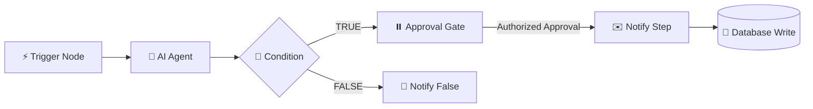

# AI Agent Workflow Builder

AI Agent Workflow Builder is a full-stack visual automation platform for designing, configuring, and executing multi-step AI-powered workflows. The platform combines node-based canvas modeling with real-time distributed execution, Google Gemini LLM reasoning, conditional branching, human-in-the-loop approval gates, automated database writes, and multi-channel notifications. Built with enterprise-grade tenant isolation and role-based access control (RBAC), the system streams live step-by-step progress via real-time WebSocket subscriptions.

---

## Features

- **Visual Workflow Canvas**: Interactive graph canvas powered by React Flow with drag-and-drop connections, custom nodes, smart snapping, and mini-map navigation.
- **Trigger Node**: Initiates workflow pipelines manually or via authenticated external Webhook events with secret verification.
- **AI Agent (Gemini Integration)**: Autonomous LLM reasoning powered by Google Gemini with prompt customization, context injection, and token tracking.
- **Conditional Branching**: Dynamic branching supporting both structured field comparisons (contains, equals, starts with, regex) and sandboxed boolean expressions.
- **Human-in-the-Loop Approval Gate**: Pauses workflow execution at sensitive checkpoints until authorized by an organization Owner or Editor.
- **Multi-Channel Notifications**: Real-time dispatching to Email (via Resend), Webhook endpoints, and Slack channels with delivery verification.
- **Database Operations (DB Write)**: Direct SQL execution and record insertion into PostgreSQL with dynamic parameter interpolation.
- **HTTP Request Action**: Configurable REST client supporting GET, POST, PUT, and DELETE methods with custom headers and payload interpolation.
- **Real-Time Execution Observability**: Live execution timeline showing step-by-step progress (0/4, 1/4, 2/4, etc.), elapsed duration, and live status pulses.
- **Node & Canvas Governance**: Per-node locking to prevent accidental movement/deletion, plus canvas locking to freeze viewport navigation during inspection.
- **Tenant & RBAC Isolation**: Multi-tenant architecture with strict organization boundaries and role permissions (`owner`, `editor`, `viewer`).
- **Demo Mode**: Instant demo session initialization for rapid evaluation without manual signup steps.
- **Interactive Workflow Guide**: Built-in interactive walkthrough and cheatsheet modal.

---

## Workflow Architecture

Workflows execute as directed acyclic graphs (DAGs) evaluated strictly according to graph topology (topologically sorted starting from the Trigger node).



### Execution Flow
1. **Trigger Phase**: A workflow run is initiated manually from the UI or via an incoming authenticated HTTP Webhook.
2. **Topological Scheduling**: The execution engine orders nodes topologically using Kahn's algorithm, ensuring dependencies finish before downstream actions start.
3. **Variable Interpolation**: Downstream nodes reference outputs from previous steps using `{{ trigger.data.field }}` or `{{ steps.StepName.output }}` template syntax.
4. **Approval Gate Checkpoint**: When an Approval Gate is encountered, the run status updates to `paused` in the database. Execution halts safely without blocking server threads.
5. **Resume on Approval**: An authorized user approves the gate, prompting the engine to resume execution for all remaining steps in topological order.
6. **Live Observability**: Live state transitions (`pending` → `running` → `paused` / `completed` / `failed`) stream to the client via GraphQL WebSocket subscriptions.

---

## Supported Nodes

| Node | Type Identifier | Description & Capabilities |
| :--- | :--- | :--- |
| **Trigger** | `trigger` | Initiates the workflow pipeline. Supports **Manual** (user click) and **Webhook** (authenticated HTTP POST) triggers. |
| **AI Agent** | `ai_agent` / `llm_call` | Executes generative AI prompts with Google Gemini. Configures model, system prompt, user prompt, and temperature. |
| **Condition** | `condition` / `conditional_branch` | Evaluates inputs to split execution paths into **TRUE** and **FALSE** branches. Supports structured rules and custom expressions. |
| **Approval Gate** | `approval_gate` | Pauses execution awaiting authorized sign-off. Enforces role-based permissions (`Owner`, `Editor`) with timeout configuration. |
| **Notify** | `notify` | Dispatches notifications via **Email** (Resend), **Webhook** (HTTP POST), or **Slack**. Includes payload formatting. |
| **Database Write** | `database` / `db_write` | Executes SQL queries and table insertions against PostgreSQL with variable interpolation. |
| **HTTP Request** | `http_request` | Dispatches outbound HTTP requests to third-party APIs with configurable headers, methods, and JSON body payloads. |

---

## AI Agent Integration

The AI Agent node integrates with the Google Gemini API to analyze incoming payloads, summarize content, and produce structured decisions.

- **Supported Models**: `gemini-3.5-flash`, `gemini-2.5-flash`, `gemini-3.5-flash-lite`, `gemini-2.5-flash-lite`.
- **Variable Interpolation**: Seamlessly inject upstream data into prompts using template syntax:
  ```
  Analyze customer order {{ trigger.data.orderId }} for amount ${{ trigger.data.amount }}.
  Provide recommendation: APPROVE or REJECT.
  ```
- **Execution Outputs**: Returns generated text, token metrics (prompt, completion, total tokens), and finish reasons.
- **Model Fallback**: Automatically tries compatible candidate models if rate limits or quota thresholds are met.
- **Deterministic Simulation Fallback**: Provides a safe local simulation fallback for development when API keys are unconfigured.

---

## Notifications

The notification engine supports three delivery channels:

### 1. Email (Resend)
- Sends HTML/text emails through the Resend API.
- Configured via server-side environment variables (`RESEND_API_KEY`, `EMAIL_FROM`).
- Enforces email address format validation.
- Captures delivery message IDs and provider status codes.
- Implements transient network retries with exponential backoff while failing fast on permanent client errors (HTTP 4xx).

### 2. Webhook
- Sends JSON payloads via HTTP POST to external endpoints.
- Supports custom headers and payload interpolation.
- Bounded with a 10-second timeout.

### 3. Slack
- Dispatches formatted alert messages to designated Slack webhook URLs or channels.

---

## Authentication & Security

- **Authentication Provider**: Powered by Nhost Auth using standard email/password authentication and JSON Web Tokens (JWT).
- **Session Persistence**: JWT access tokens and user session state persist seamlessly across page refreshes and browser tabs.
- **Multi-Tenant Isolation**: Workflows, steps, runs, and execution logs are scoped strictly to the user's organization (`organization_id`). Cross-organization access is blocked at both the API and database levels.
- **Role-Based Access Control (RBAC)**:
  - **Owner**: Full access to create, edit, execute workflows, manage organization members, and approve gates. Privileged steps (`db_write`, `notify`, `webhook`) require Owner permissions to configure.
  - **Editor**: Can create and edit workflows, run pipelines, and approve gates.
  - **Viewer**: Read-only access to view workflows and execution runs.
- **Credential Protection**: API keys (Gemini, Resend, Hasura Admin Secret) and database credentials are strictly isolated to server-side environments and never bundled into client JavaScript.
- **Sandboxed Expression Evaluator**: Condition expressions are evaluated within a secure, isolated scope that strips access to `process`, `window`, `global`, `require`, and prototype chains.

---

## Demo Mode

For rapid testing and evaluation without manual account registration:

1. Open the application.
2. Click **"Try Demo — Instant Access"** on the login screen.
3. The platform automatically authenticates a provisioned demo account through the standard Nhost authentication pipeline.
4. A clean, pre-configured 4-node workflow (**Trigger &rarr; AI Agent &rarr; Condition &rarr; Notify**) is loaded on the canvas ready to run.

---

## Execution & Observability

The platform provides comprehensive execution monitoring:

- **Compact Execution Timeline**: Real-time progress bar and status indicator docked at the bottom of the canvas displaying active progress (e.g. `2 / 4 (50%) Paused`).
- **State Indicators**: Visual badges indicating `pending` (○), `running` (●), `paused` (⏸), `completed` (✓), and `failed` (✕).
- **Inspector Output Panel**: Clicking any node opens the Node Properties Panel showing real-time execution outputs, HTTP response headers, token consumption, and delivery confirmations.
- **Execution Attribution**: Errors are accurately attributed to the specific failed node, displaying normalized error explanations without exposing internal stack traces.

---

## Node Locking & Canvas Controls

- **Per-Node Locking**: Clicking the lock icon (🔒) in the node toolbar locks individual nodes. A locked node cannot be dragged or deleted, but remains fully selectable for configuration and output inspection.
- **Canvas Locking**: Clicking **"Canvas Lock"** in the bottom-left controls freezes viewport panning and zoom transformations, ensuring canvas stability during presentations while keeping nodes interactive.
- **Node Deletion**: Nodes can be deleted via the contextual toolbar or using the keyboard shortcut (`Delete` / `Backspace`). Locked nodes are protected against deletion.

---

## Tech Stack

- **Framework**: [Next.js 16](https://nextjs.org/) (App Router, Turbopack, React Server Components)
- **Frontend Core**: [React 19](https://react.dev/), [TypeScript 5](https://www.typescriptlang.org/)
- **Visual Canvas**: [@xyflow/react](https://reactflow.dev/) (React Flow v12)
- **Styling**: [Tailwind CSS v4](https://tailwindcss.com/)
- **Authentication & Backend**: [Nhost](https://nhost.io/) (Nhost Auth, Hasura GraphQL Engine, PostgreSQL)
- **AI Intelligence**: [Google Gemini API](https://ai.google.dev/)
- **Email Delivery**: [Resend](https://resend.com/)

---

## Project Structure

```
ai-workflow-builder/
├── frontend/
│   ├── public/                    # Static assets and icons
│   ├── scripts/                   # Automated test suites and regression scripts
│   ├── src/
│   │   ├── app/
│   │   │   ├── api/
│   │   │   │   ├── actions/       # Hasura Action webhooks (trigger, approve)
│   │   │   │   ├── auth/          # Auth helpers and demo endpoint
│   │   │   │   ├── triggers/      # Inbound webhook trigger endpoints
│   │   │   │   └── workflows/     # Workflow CRUD API endpoints
│   │   │   ├── globals.css        # Global CSS design system and animations
│   │   │   ├── layout.tsx         # Root layout and font configurations
│   │   │   └── page.tsx           # Main application canvas & state orchestration
│   │   ├── components/
│   │   │   ├── BrandLogo.tsx           # SVG platform branding logo
│   │   │   ├── ExecutionTimeline.tsx   # Real-time execution progress bar
│   │   │   ├── LoginScreen.tsx         # Authentication & Demo access screen
│   │   │   ├── NodePropertiesPanel.tsx # Node configuration & output inspector
│   │   │   ├── WorkflowGuide.tsx       # Interactive walkthrough modal
│   │   │   └── WorkflowNode.tsx        # Custom React Flow node component
│   │   ├── context/
│   │   │   └── AuthContext.tsx    # Nhost authentication context provider
│   │   ├── lib/
│   │   │   ├── auth.ts            # Server-side auth & token extraction
│   │   │   ├── graphOrder.ts      # Kahn's topological sort implementation
│   │   │   ├── hasura.ts          # Hasura GraphQL execution client
│   │   │   ├── nhost.ts           # Nhost client initialization
│   │   │   └── workflowExecution.ts # Core server-side workflow execution engine
│   │   └── types/
│   │       └── workflow.ts        # TypeScript domain models and schemas
│   ├── .env.example               # Environment variable configuration template
│   ├── next.config.ts             # Next.js configuration
│   ├── package.json               # Dependencies and scripts
│   └── tsconfig.json              # TypeScript compiler configuration
└── README.md                      # Project documentation
```

---

## Getting Started

### Prerequisites
- [Node.js](https://nodejs.org/) (v18.17+ or v20+ recommended)
- [npm](https://www.npmjs.com/) (or yarn / pnpm)

### Installation

1. **Clone the repository**:
   ```bash
   git clone https://github.com/MraviTeja95/AI-Workflow-Builder.git
   cd AI-Workflow-Builder/frontend
   ```

2. **Install dependencies**:
   ```bash
   npm install
   ```

3. **Configure environment variables**:
   ```bash
   cp .env.example .env.local
   ```
   Edit `.env.local` with your configuration details (see [Environment Variables](#environment-variables)).

4. **Run the development server**:
   ```bash
   npm run dev
   ```

5. **Open the application**:
   Navigate to [http://localhost:3000](http://localhost:3000) in your browser.

---


## Testing & Quality Assurance

The repository includes a comprehensive automated test suite covering authentication regression, RBAC authorization, workflow execution, approval gate lifecycles, and topological ordering.

### Running Quality Checks

```bash
# TypeScript Type Checking
npx tsc --noEmit

# Code Linting
npm run lint

# Production Build Verification
npm run build
```

### Running Automated Test Suites

```bash
# Authentication Regression & Tenant Isolation
node scripts/test-auth-regression.mjs

# Layer 2 RBAC Security Matrix
node scripts/test-layer2-security.mjs

# Phase 4 Full Acceptance & Integration Harness
node scripts/test-phase4-acceptance-suite.mjs

# Approval Gate Pause/Resume & Authorization E2E
node scripts/test-approval-gate-e2e.mjs

# Topological Graph Ordering & State Machine
node --experimental-strip-types scripts/test-approval-gate-graph-order.mjs
```

---

## Error Handling & Reliability

- **Transient Network Retries**: Server-side dispatches to Resend, Webhooks, and Hasura GraphQL employ exponential backoff retries (up to 3 attempts) for transient TCP resets or network timeouts (`fetch failed`, `ECONNRESET`, 5xx responses).
- **Fast-Fail on Permanent Errors**: 4xx client errors (e.g. 400 Bad Request, 403 Forbidden, 422 Invalid Format) fail immediately on the first attempt to prevent duplicate actions or provider spamming.
- **Bounded Timeouts**: All outbound server requests are guarded with `AbortSignal.timeout` bounds (10s–20s) to prevent hanging serverless instances.
- **Atomic Run Guard**: The UI execution handler uses atomic reference locks (`isRunningWorkflowRef`) to prevent duplicate runs from rapid double-clicks.
- **Normalized Error Reporting**: Low-level exceptions are normalized into descriptive, user-friendly messages displayed on the canvas and in the inspector panel without exposing internal stack traces.

---

## Security Notes

1. **Secret Isolation**: All API keys (`GEMINI_API_KEY`, `RESEND_API_KEY`, `HASURA_GRAPHQL_ADMIN_SECRET`) remain strictly server-side.
2. **Environment Template**: Use `.env.example` as the basis for deployments; `.env.local` is ignored by Git.
3. **Database Security**: Database writes validate authorized permissions and sanitize SQL operations to prevent injection attacks.
4. **Sandboxed Expressions**: Client-submitted condition expressions cannot access global runtime objects or execute unauthorized system commands.


